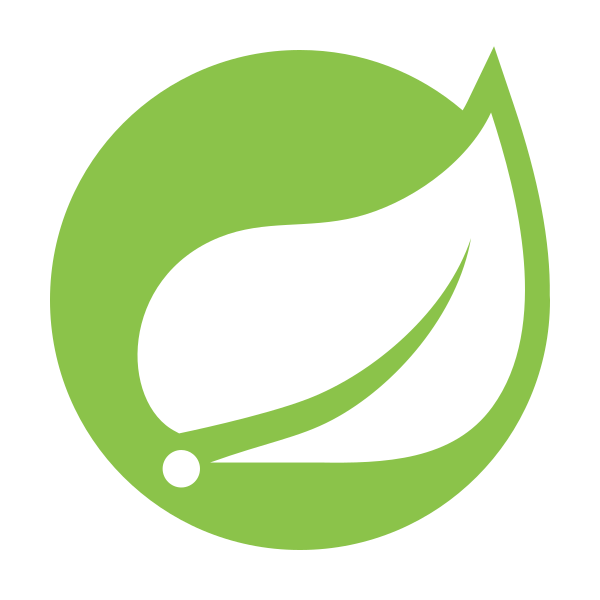

 
  <h1>🙌¡Hola, soy Ignacio!🙌</h1>

**Actualmente cursando la carrera 'ANALISTA PROGRAMADOR' en 'DUOC UC'**

  

**SOBRE MÍ**

- 📅Tengo 20 años
- 🔌Mis lenguajes preferidos son Java y C
- 🎶Mi hobby favorito es la música
- ⚙️Interesado en la Automatización

  <h2>🔌Lenguajes & Frameworks🔌</h2>

  
  
  
  
  

  <h2>🖌️FrontEnd🖌️</h2>

  
  
  

